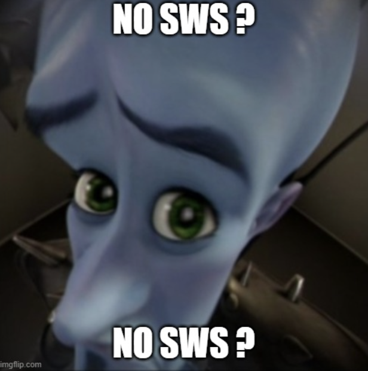

# So We'Re Here

Une extension **Firefox** pour [SoWeSign](https://app.sowesign.com/login) 👊 💪 ✏️

- **SoWeSketch** : signer avec une image (original repo)
- **SoWeHere** : afficher le code de présence du prochain cours, le saisir en un clic, et charger sa signature enregistrée (AutoSign)

## Features

- intégration automatique dans le site de SoWeSign
- sélection d'images en local pour signer
- affichage du code de présence du cours en cours (ou du prochain) dans le popup
- saisie du code en un clic
- **AutoSign** : saisie du code, puis chargement automatique de ta signature enregistrée (il ne reste qu'à cliquer sur « Valider »)
- facile et rigolo
- pas forcément légal mais tkt

## Comment installer ?

L'extension utilise des API propres à Firefox (`browser.*`, `webRequest.filterResponseData`) : elle ne fonctionne **pas** sur Chrome.

1. Télécharger les fichiers du repo GitHub
2. Les décompresser
3. Ouvrir Firefox
4. Aller à l'URL `about:debugging#/runtime/this-firefox`
5. Cliquer sur `Charger un module complémentaire temporaire…`
6. Sélectionner le fichier `manifest.json` du dossier de l'extension
7. Ta-daaaa !

Un module temporaire disparaît à la fermeture de Firefox : il faut le recharger à chaque démarrage.

## Comment l'utiliser ?

### Signer avec une image

1. Aller sur la page de signature de SoWeSign.
2. Cliquer sur **Signer avec une image** (le bouton ajouté sous « Valider »).
3. Choisir une image : elle est dessinée dans le cadre de signature, puis le bouton « Valider » s'active.

### Code de présence

1. Ouvrir (ou recharger) `app.sowesign.com` : l'extension mémorise la liste des prochains cours renvoyée par le site.
2. Ouvrir le popup de l'extension : il affiche le code du cours en cours, ou du prochain si aucun n'est en cours.
3. Sur la page de saisie du code, cliquer sur le code pour le remplir automatiquement.

Les horaires du site sont en UTC : l'extension les convertit pour choisir le bon cours, quel que soit ton fuseau horaire.
Si le code est faux ou absent, recharge `app.sowesign.com` pour rafraîchir la liste des cours.

### AutoSign

1. Dans le popup, cliquer sur **Set signature…** : une page s'ouvre pour choisir une signature au format **JPG** (elle est réduite à 1000 px de large au maximum et stockée localement dans l'extension, rien n'est envoyé ailleurs).
2. Sur la page de saisie du code, cliquer sur **AutoSign** dans le popup (le bouton n'apparaît que si une signature est enregistrée).
3. Le code est saisi, puis, quand la page de signature s'ouvre, l'image est chargée dans le cadre.
4. Cliquer sur « Valider » : la validation reste volontairement manuelle.

Si la page de signature met plus de 2 minutes à s'ouvrir après le clic, rien n'est chargé.

## Structure du projet

| Fichier | Rôle |
| --- | --- |
| `manifest.json` | déclaration de l'extension (Manifest V2, Firefox) |
| `scripts/content.js` | injecté dans SoWeSign : bouton « Signer avec une image », dessin de l'image, AutoSign |
| `scripts/fill.js` | saisie du code dans les cases de la page |
| `background.js` | lit la réponse de l'API `future-courses` et la stocke |
| `code.js` | choix du cours (`pickCourse`) et calcul du code (`generateFixedCode`) |
| `popup.html` / `popup.js` | popup : code, AutoSign, lien vers les réglages |
| `options.html` / `options.js` | page de réglages : choix de la signature JPG |

### Notes techniques

- Le composant de signature de SoWeSign est un composant Angular maison. Il lit le canvas uniquement au `mouseup` (écouté sur l'élément `<signature-pad>`) : `content.js` dessine donc l'image, puis envoie un `mouseup` sur le canvas.
- Sous Firefox, `drawImage()` d'une image créée par le content script « souille » le canvas pour la page (`toDataURL()` lève `SecurityError`) : l'image est donc dessinée sur un canvas annexe, puis copiée avec `putImageData()`.

## Comment participer ?

### Soutenir financièrement

~~Je metterai ici mon Lydia bientôt~~

### Signaler des bugs

1. **Assurez-vous que le bug n'a pas déjà été signalé** en effectuant une recherche sur GitHub sous [Problèmes](https://github.com/gregoire-badiche/SoWeSketch/issues).

2. Si vous ne parvenez pas à trouver un ticket ouvert résolvant le problème, [ouvrez-en un nouveau](https://github.com/gregoire-badiche/SoWeSketch/issues/new).

### Suggérer des améliorations

1. Créez un problème de demande de fonctionnalité détaillant ce que vous aimeriez voir implémenté.

### Contribution au code

#### Comment faire ?

1. Forkez le dépôt sur GitHub.
2. Clonez le repo forké.
3. Créez une nouvelle branche de fonctionnalités basée sur « main ».
4. Effectuez vos modifications.
5. Assurez-vous que le code adhère au style existant.
6. Soumettez une pull request sur la branche « principale » du upstream repo.

#### Conventions de codage

- Nous utilisons principalement JavaScript pour ce projet.
- Suivez les meilleures pratiques JavaScript modernes.
- Les commentaires sur le code sont appréciés.
- les classes et les ids injectées dans la page HTML doivent commencer par `wtf-`

#### Messages de validation

Écrivez des messages de commit Git clairs et significatifs (ils peuvent être drôles, mais soyez clairs aussi).
Ce n'est pas idéal d'avoir quelque chose comme « Augmentation du troll de 500% », mais vous pourriez dire « Dessin en couleur, augmentation du troll de 500% ».
J'ai juste besoin de savoir ce que vous avez fait.

#### Pull requests

Assurez-vous que vos PR sont petites, ciblées et que vous expliquez clairement les modifications apportées dans la description.

### Licence

En contribuant à ce projet, vous acceptez que vos contributions soient sous licence selon les mêmes conditions que celles utilisées dans le projet.

❗❗ Je ne suis pas responsable de l'utilisation que vous en faites, ni des conséquences qui peuvent en découler ❗❗

## Des questions ?

N'hésitez pas à contacter les responsables du projet si vous avez des questions ou des préoccupations.

## Remerciements

Merci à Varoujan pour son support émotionel, à Linus pour ses memes de qualité, et à David pour son WIFI haute performance.

Développé avec le ❤️ par Grégoire
